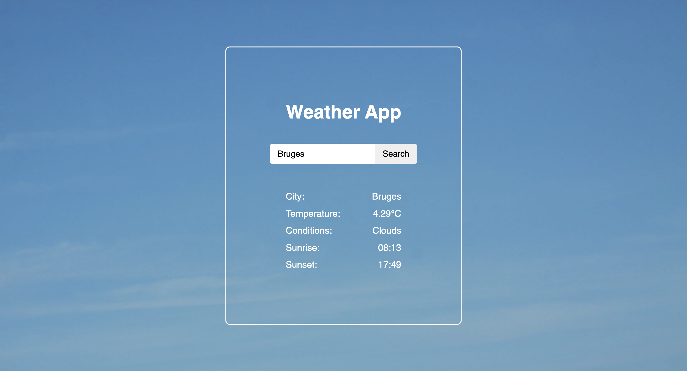
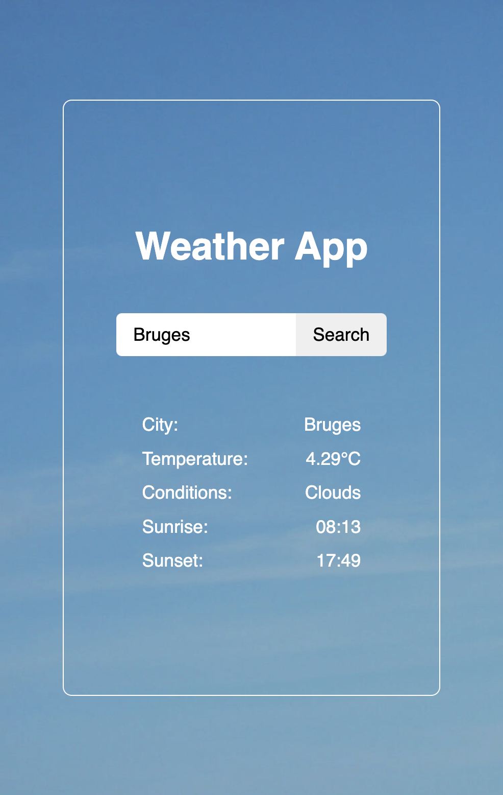

# Weather App

A simple and minimalistic weather app built with React. The app displays the temperature, weather conditions, sunrise, and sunset times for any city. Both desktop and mobile versions are supported.

## Features

- Search for any city to get real-time weather data.
- Displays temperature, weather conditions, sunrise, and sunset times.
- Designed with a simple and clean interface.
- Mobile-friendly design.
- No ads or unnecessary distractions.

## Technologies Used

- React
- OpenWeatherMap API (for fetching weather data)
- JavaScript (ES6+)
- CSS

## Installation

1. Clone the repository to your local machine:
   ```sh
   git clone https://github.com/your-username/weather-app.git
   ```
2. Navigate to the project directory:
   ```sh
   cd weather-app
   ```
3. Install the required dependencies:
   ```sh
   npm install
   ```
4. Start the app:
   ```sh
   npm start
   ```
5. Open the app in your browser by visiting [http://localhost:3000](http://localhost:3000).

## How to Use

1. Enter the name of a city in the input field and click the "Search" button or press "Enter."
2. The app will display the temperature, weather conditions, and times for sunrise and sunset.
3. You can resize the window to see the mobile version.

## Screenshots

### Desktop Version  


### Mobile Version  


## License

This project is open-source and available under the MIT License.

